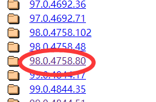

# MIUIhelper
* 最近想给手机root一下，发现居然要等7天，我又没有测试资格，为了防止以后再出现类似情况，于是决定写个脚本攒分  
* 该脚本需要使用`Python 3.6`以上版本运行  
* 抓包过程中有被加密数据，我无法处理，故使用了`selenium`,目前仅支持了`Chrome`浏览器(其他浏览器请自行调整代码)  
    * `selenium`支持`FireFox`,`chrome`,`Ie`,`Edge`,`Safari`等众多浏览器(未列举完)，使用其他浏览器需要微调`web.py`
* 答题准确性需要数据的支撑，若出现未记录的答案，将会随机选择并记录，欢迎大家提交数据，如`correct.json`(我也会不定期上传数据到Gitee)  
* 支持多账号答题  
# 安装
* Python的第三方库安装  
    ```
    pip3 install requests
    pip3 install selenium
    ```  

* 浏览器安装(以Chrome为例)  
    * Windows：https://www.google.com/chrome/
    * Linux  
        * Ubuntu、Debian  
        ```
        wget https://dl.google.com/linux/direct/google-chrome-stable_current_amd64.deb
        sudo apt install ./google-chrome-stable_current_amd64.deb
        ```
        * CentOS  
        ```
        wget https://dl.google.com/linux/direct/google-chrome-stable_current_x86_64.rpm
        sudo dnf localinstall ./google-chrome-stable_current_x86_64.rpm
        ```

* 浏览器版本查看  
    * Windows  
      
    * Linux  
      
    `google-chrome --version`  
  
* 将`Chromedriver`放入该项目目录下，`Chromedriver`的版本需要根据浏览器选择  
    * [Chromedriver下载](http://chromedriver.storage.googleapis.com/index.html)  
    * 根据浏览器版本选择(以Linux为例，我的浏览器版本为`98.0.4758.80`)  
      
      

* 最后将`chromedriver`放入该项目的目录下，至此结束  
      
  
# 使用  
* 将小米账户的`账号`和`密码`分别填入`accounts.json`中的`account`与`password`，支持多账号答题  
* 自动运行  
    * Windows 可以使用系统自带的`计划任务`(详见百度)  
    * Linux 可以使用`crontab`  
